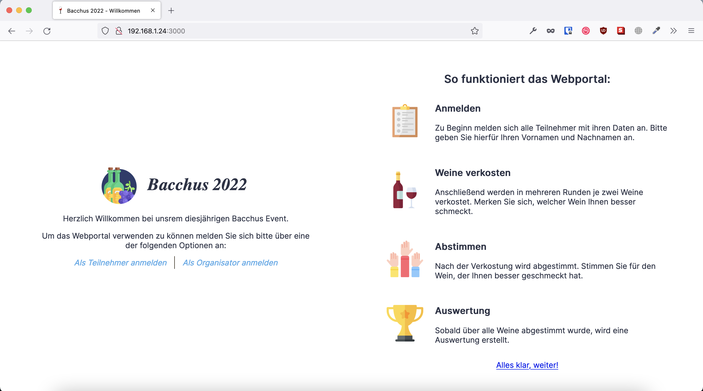
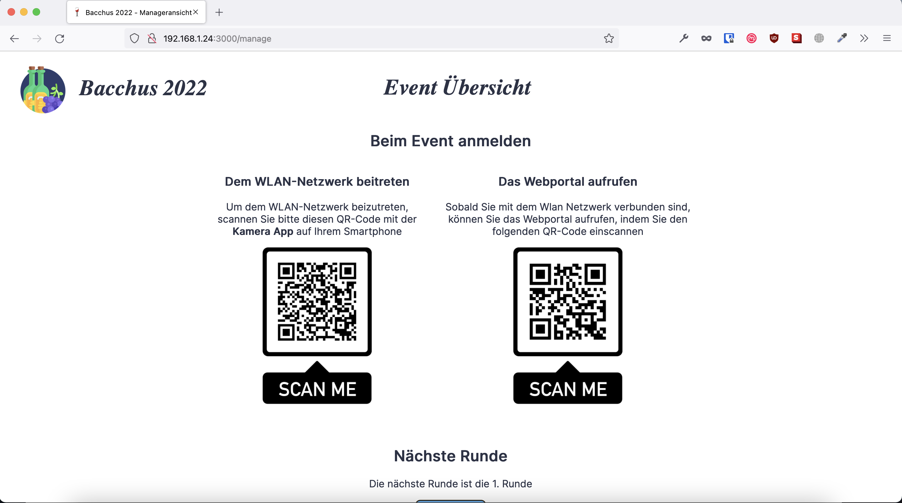
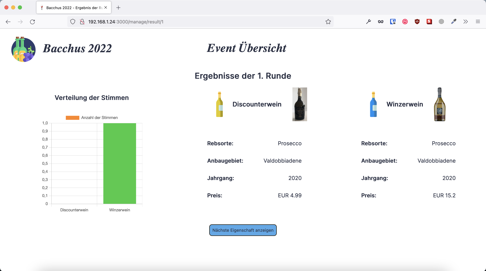
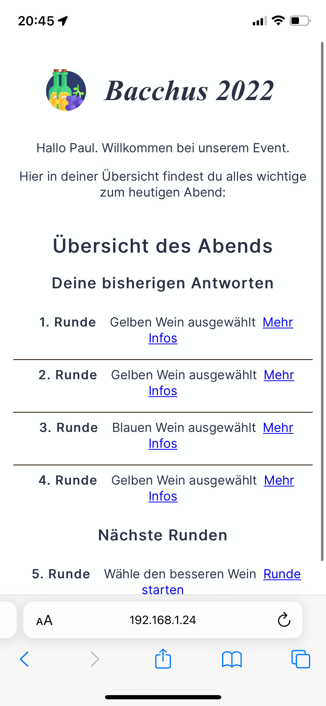
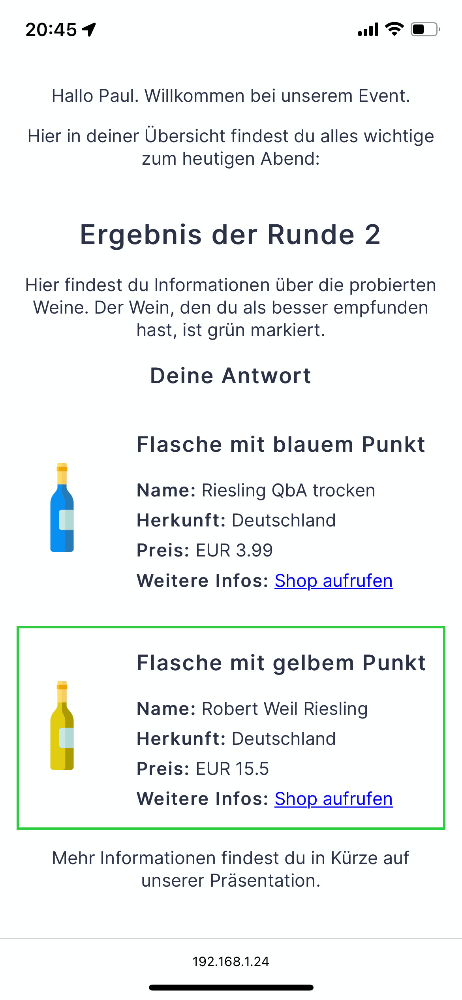
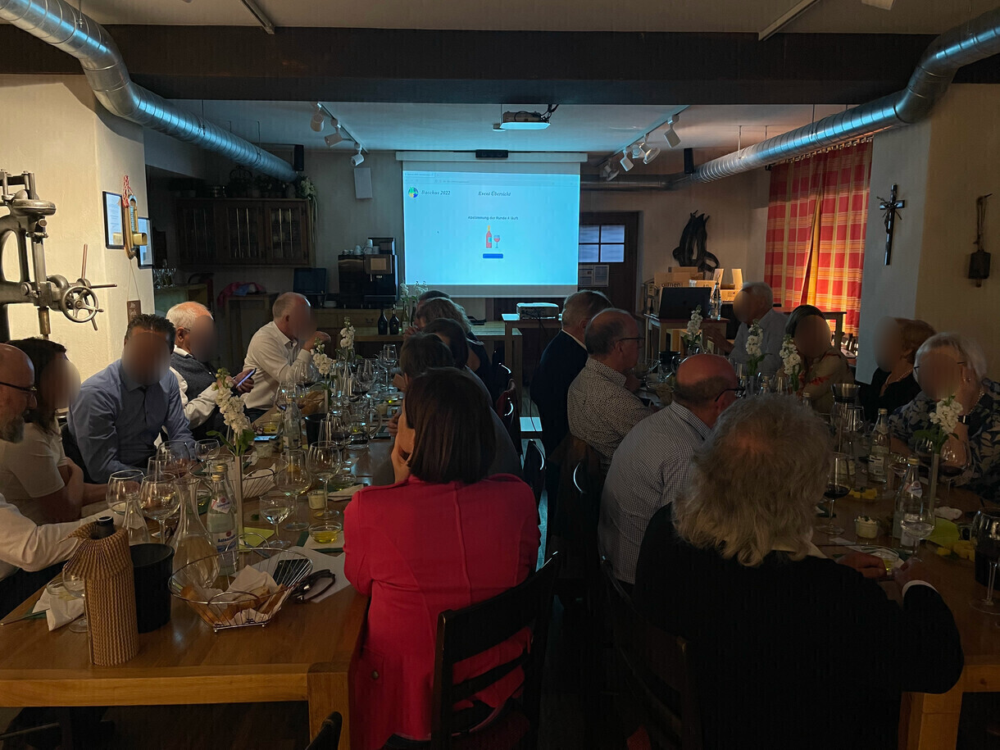
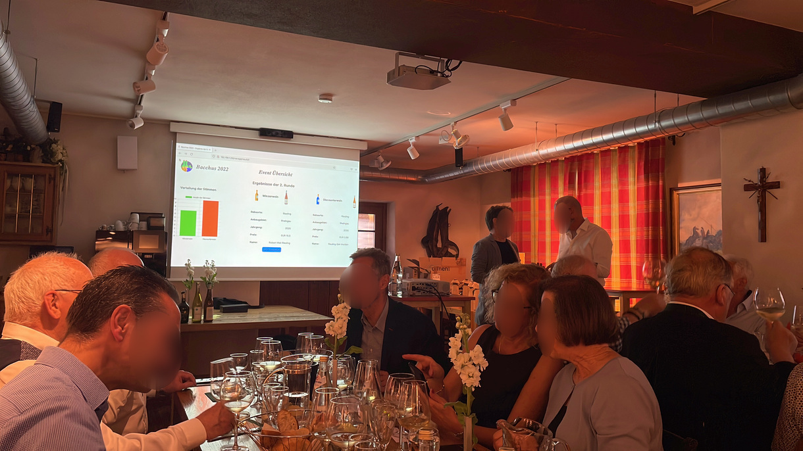

# Webportal Bacchus 2022

Die Webseite wurde für das jährliche Treffen der Bacchusfreunde Günzburg (nicht eingetragener Verein) im Jahr 2022 entwickelt.

 

## Funktionsweise

Mit der Webseite können die Teilnehmer des Events einen Account erstellen und mit diesem an Umfragen über die verkosteten Weine teilnehmen.

Hierfür wurden immer zwei Weine blind verkostet, wobei es sich um einen hochwertigen und einen billigen Wein handelte, und anschließend wählten die Nutzer den Wein aus, der ihnen besser geschmeckt hat. Nach jeder Verkostung wurden die Ergebnisse an einem Beamer präsentiert.

Zum Ende des Events wurde eine Gesamtauswertung erstellt, welche zeigte, ob insgesamt die teureren oder billigeren Weine den Teilnehmern besser geschmeckt haben.

Die Nutzer konnten zusätzlich sehen, ob sie sich öfter für einen billige oder hochwertigen Wein entschieden haben.

 

## Eindrücke von der Webseite

Die Willkommens Seite

 

Die Login Seite

 

Die Ergebnis Seite

 

 
Die persönliche Ansicht

 

## Eindrücke des Abends

Runde während der Weinverkostung

 

Die Ergebnisse der Runde
